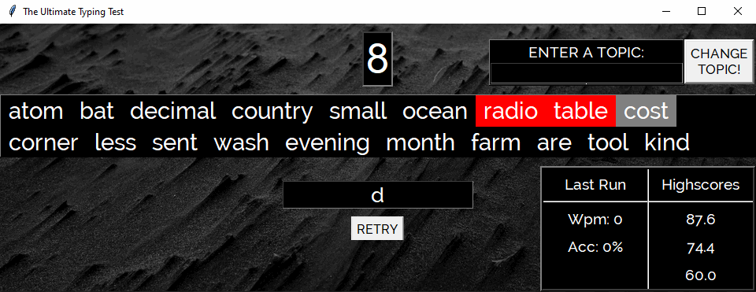
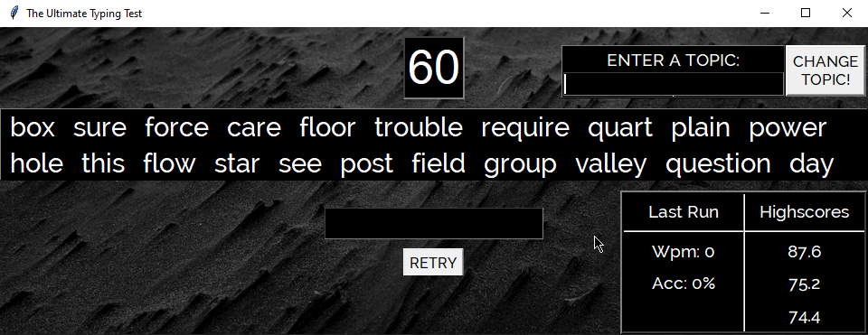

# Typing-Test-Application

A GUI program that measures a user's typing speed based on characters typed per-minute divided by 
the average character count for words (which is 5) and subtracting by the number of incorrect words per-minute.

The topic searchbar uses the Python Wikipedia library to provide the user with options of Wikipedia articles. Once selected, 
the HTML is downloaded and parsed to extract only the body text of the article. The text is then prepared and displayed on-screen
for the user to start the typing test. 

The Python GUI library used is TKinter. A class is made for each major TKinter Frame object (a container for TKinter widgets). 
This helps to decouple the classes and allows for better scalability of the program. 

A single data class, called WidgetModel, is used to store shared data between the Frame classes. The variables are updated
within the Frame classes themselves. 

## Showing the user typing experience: 

## Showing how to change topics: 
##### Changing a topic will provide a new set of text to type out. The text are taken out of Wikipedia articles.

